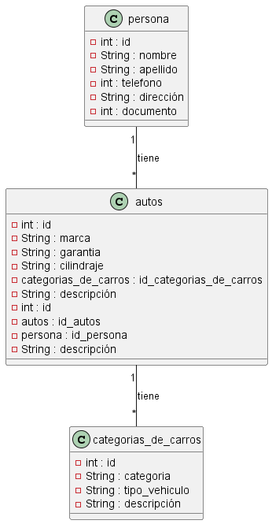

# corte2_1084330566

#### nececidad: se requiere desarrollar un sistema que permita almacenar la `categoria_de_carros` se requieren almacenar `4` atributos , los `autos` requieren almacenar `6` atributos, los `Autos_persona` requieren almacenar `4` atributos, y las `personas` y `6` atributos almacenar.

#### requerimientos funcionales:

1. RF 1: En las categorias_de_carros se nececita almacenar el `id` , `categoria`, `tipo_vehiculo` y `descripción`.
2. RF 2: En los autos se almacena el `id`, `marca`, `garantia`, `cilindraje`, `id_categorias_de_carros` y `descripción`.
    - ref: se requiere tener información almacenada en categoria_de_carros.
3. RF 3: En las persona se almacena el `id`, `nombre`, `apellido`, `telefono`, `dirección` y `documento`.
4. RF 4: En Autos_persona requiere almacenar el `id`, `id_autos`, `id_persona` y `descripción`.
    - ref: se requiere tener informacion almacenada en autos.
    - ref: se requiere tener informacion almacenada en personas.


#### Diseñar Base de Datos
`categorias_de_carros`

| id | categoria         | tipo_vehiculo | descripción |
|----|-------------------|---------------|-------------|
| 1  | alto cilindraje   |deportivo      | idal        |
| 2  | alto cilindraje   |trocha         |idal         |
| 3  | alto cilindraje   |deportivo      |idal         |


`autos`

| id | marca         | garantia | cilindraje | id_categorias_de_carros | descripción|
|----|---------------|----------|------------|-------------------------|------------|
| 1  |         bmw   | 1 año    |3000        |  1                      | ideal      |
| 2  | toyota        | 2 años   |2000        |  2                      | ideal      |
| 3  | bugati        | 4 años   |6000        |  3                      | ideal      |

`persona`

| id | nombre        | apellido | telefono | dirección   | documento|
|----|---------------|----------|----------|-------------|----------|
| 1  |    jose       | vargas   |3145789   | cr 11 24 sur| 1547920  |
| 2  |  leonardo     | herrera  |3256879   | cll 1 18    | 1578928  |
| 3  |  julian       | romero   |3147899   | cr 12 78 sur| 1687872  |

`Autos_persona`

| id | id_autos | id_persona | descripción |
|----|----------|------------|-------------|
| 1  |  1       |   1        |idal         |
| 2  |  2       |   2        |idal         |
| 3  |  3       |   3        |idal         |

> Script de la base de datos
```sql
    DROP DATABASE IF EXISTS parcial;

    CREATE DATABASE parcial;

    USE parcial;

    CREATE table categorias_de_carros (
        id INT NOT NULL PRIMARY KEY AUTO_INCREMENT,
        categoria VARCHAR1(150) NOT NULL UNIQUE,
        tipo_vehiculo VARCHAR(150) NOT NULL,
        descripción VARCHAR(150) NOT NULL
        
    ); 

    CREATE table autos (
        id INT NOT NULL PRIMARY KEY AUTO_INCREMENT,
        marca VARCHAR(150) NOT NULL,
        garantia DATE NOT NULL,
        cilindraje INT NOT NULL,
        FOREIGN KEY (id_categorias_de_carros) REFERENCES categorias_de_carros(id),
        descripciónVARCHAR(150) NOT NULL
    ); 

    CREATE table persona (
        id INT NOT NULL PRIMARY KEY AUTO_INCREMENT,
        nombre VARCHAR1(150) NOT NULL UNIQUE,
        apellido VARCHAR(150) NOT NULL,
        telefono INT NOT NULL,
        dirección VARCHAR(150) NOT NULL,
        documento INT NOT NULL
    ); 

    CREATE table Autos_persona  (
        id INT NOT NULL PRIMARY KEY AUTO_INCREMENT,
        FOREIGN KEY (id_autos) REFERENCES autos(id),
        FOREIGN KEY (id_persona) REFERENCES persona(id),
        descripción VARCHAR(150) NOT NULL
        
    ); 
```




[ver](https://trello.com/b/lInsAP0U/proyecto-de-carros)
